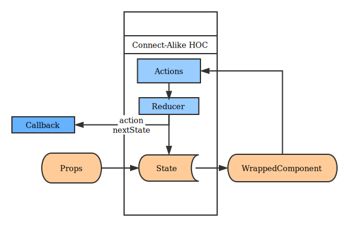

# Local State Management for React Component

Using local component state is fine, but when there are complex view logic inside the 
component we want something alike Redux or other state management.  Instead of using 
local store or RxJS, this package, by wrapping `setState`, provides a Redux-like way 
to develop reactive components.

1. Support async actions 
2. Pass handlers easily
3. Support callbacks to communicate with other component
4. Least surprise for Redux users

## How does it work:



To not surprise Redux users, the HOC created by connect-alike mimic a redux workflow. 

## Usage 
```js
import connectAlike from 'connect-alike';

let SmartLocalComponent = 
  connectAlike(mapPropsToState, mapPropsToActionCallback, reducers, actions)
              (mapStateToProps)
              (WrappedComponent)
```

The first set of arguments includes:
1. `mapPropsToState`: used for initializing a HOC state as a Redux-like store. The argument maps the initial `props` in `constructor` and `nextProps` in `componentWillReceiveProps` 
3. `reducers` function of `(prevState, action) => nextState`, or nested Object reducers supported by [redux-declare](https://github.com/zhujinxuan/redux-declare). 
4. `actions` Object of `[actionsName]: (payload)=>action`, or nested Object actions supported by [redux-declare](https://github.com/zhujinxuan/redux-declare)
  - You could use `dispatch => thunk` to apply async actions
  - The action handlers are passed to props by `props.handlers` and `props.passThrough`; See Document at [actions][actions]
2. `mapPropsToActionCallback`: Object of `{[actionName]: (action, nextState) => callback}`.  It enables communication with other components, 
  - The callback is bound to the setState of HOC.  When a inner action is dispatched, the HOC will call the matched callback.

The second set of argument includes
1. `mapStateToProps`: maps the HOC state to the props of the next

The third set of argument includes
1. `WrappedComponent` a stateless React Component for wrapping. Recommended to use a dumb component here. 
  - Functional JSX is not accepted here.

## Document 

## Example 
You could have a look on `demo/`
1. Simple Counter: `demo/Counter/index.js`
2. Aysnc Counter: `demo/CounterWithAsync/Counter.js`
3. Counter with Logger: `demo/CounterWithLogger/Counter.js`
